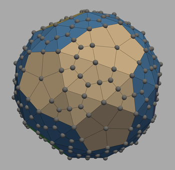

# PolyClash: Go on a Spherical Universe

## The Eternal Game Reimagined

> *"Like mathematical truth, Go is an eternal game in the universe. Similarly, the snub dodecahedron is also an eternal geometric shape, which is the Archimedean polyhedron with the most sphericity. PolyClash combines these two to create a new game with simple rules that make for interesting gameplay."*

PolyClash is a revolutionary reimagining of the ancient game of Go, played on a snub dodecahedron—a near-spherical Archimedean solid that brings new dimensions to this timeless strategy game.

## The Beginning of Our Exploration

The tale of Emperor Yao inventing Go to educate his son Danzhu may be unverifiable, yet the profound history of Go remains indisputable. Across East Asia, Go is a beloved pastime, and professional Go players are held in high regard. Despite its straightforward rules, Go harbors boundless complexity in its gameplay, earning it the reputation of an eternal game within the cosmos.

Playing Go on a spherical surface is a problem that many have already considered. However, adapting a quadrilateral grid to a sphere presents significant challenges. Our approach introduces a different topological structure for the board—the snub dodecahedron.

## Why the Snub Dodecahedron?

Among the 13 Archimedean solids, the snub dodecahedron stands out with its:
- 80 equilateral triangular faces
- 12 pentagonal faces
- 60 vertices
- 150 edges

This polyhedron exhibits very high symmetry and is the closest to a spherical shape among all Archimedean solids. Only such mathematical perfection can inspire us to explore a new game that is eternal.

With a total of 302 elements (80 + 12 + 60 + 150), the board offers substantial complexity, approaching the 361 grid points of traditional Go.

## The Game Board



The game board features different colored regions representing "continents" and "oceans." Three neighboring pentagons constitute a "continent," resulting in four continents on the game board. These four continents correspond to four axes of symmetry, with the ocean opposite each continent.

This design enhances visual intuitiveness and provides absolute positioning for placing stones.

## Game Mechanics

In PolyClash, players place stones on the vertices of the snub dodecahedron, capturing opponent stones by surrounding them and controlling territory.

The board features points of varying degrees:
- Degree 3: Centers of triangular faces (80 points)
- Degree 4: Midpoints of edges (150 points)
- Degree 5: Original vertices and centers of pentagonal faces (72 points)

With an average degree of 3.97, the game board closely resembles a four-degree board, but with strategic variations based on the different point types.

The smallest live shape in PolyClash requires only 7 stones, remarkably close to Go's 6 stones, highlighting the intrigue and challenges of our game.

## Features

- **3D Visualization**: Fully interactive 3D visualization of the game board
- **Multiple Game Modes**: Play locally against another human or AI, or play online against other players
- **AI Opponent**: Challenge yourself against our AI, which uses strategic algorithms to provide a worthy opponent
- **Network Play**: Play against other players over a local network or the internet
- **Cross-Platform**: Works on Windows, macOS, and Linux

## Getting Started

### Installation

```bash
pip install polyclash
```

### Running the Game

```bash
polyclash-client
```

For more detailed instructions, see the [Installation Guide](docs/02_installation.md).

## Game Rules

The rules of PolyClash are similar to traditional Go, with adaptations for the spherical board:

1. Players take turns placing stones on the vertices of the snub dodecahedron
2. A stone or group of stones is captured when all its liberties (adjacent empty points) are occupied by opponent stones
3. The game ends when both players pass consecutively
4. The score is calculated based on the area controlled by each player

For a complete explanation of the rules, see the [Game Rules](docs/03_game_rules.md).

## Development

PolyClash is an open-source project, and contributions are welcome! We have a comprehensive roadmap for improving the game, including:

- Enhanced testing framework
- Advanced AI algorithms (Monte Carlo Tree Search)
- Improved user experience
- Enhanced network play
- And much more!

See our [Development Plans](plans/README.md) for more details.

## Community

Join our community to discuss strategies, report bugs, or contribute to the development:

- [GitHub Issues](https://github.com/spherical-go/polyclash/issues)
- [Discord Server](https://discord.gg/polyclash)
- [Reddit Community](https://reddit.com/r/polyclash)

## License

PolyClash is licensed under the MIT License. See the [LICENSE](LICENSE) file for details.

---

*"In introductory Go classes, we're all familiar with the saying '金角银边草肚皮' (gold in the corners, silver on the sides, grass in the center). But on a sphere, where are the corners? Where are the sides? This is just one of the fascinating strategic questions that PolyClash invites you to explore."*
