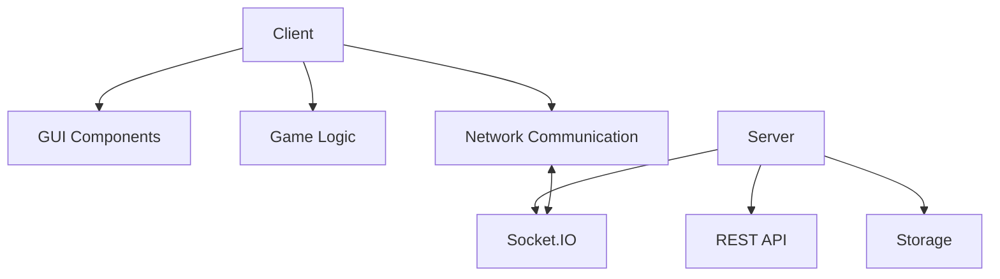
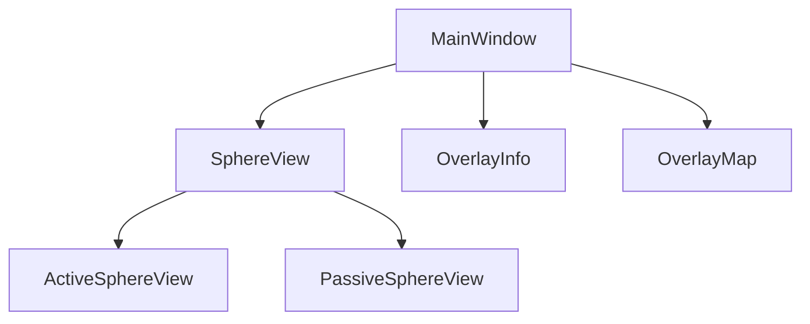
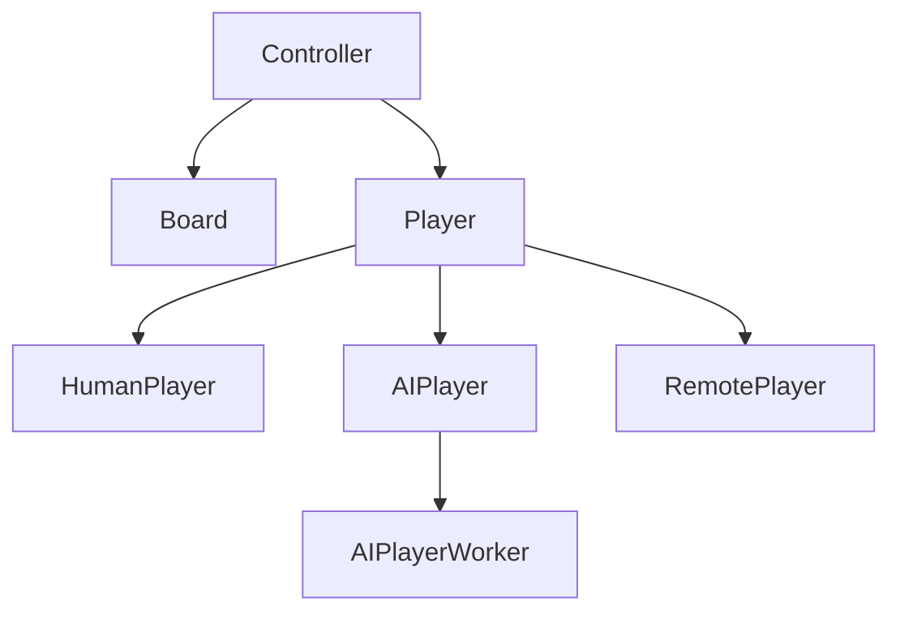
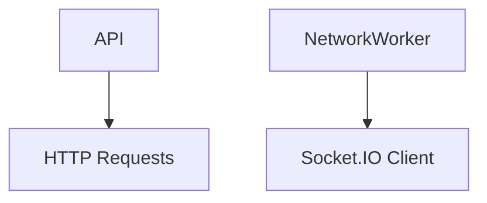
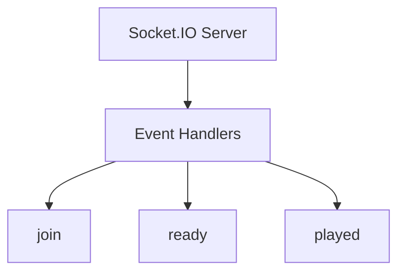
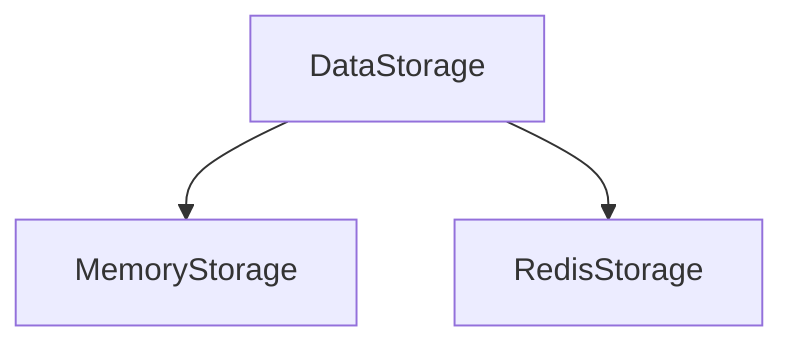

# Architecture

This document provides an overview of the PolyClash architecture, explaining how the different components interact with each other.

## High-Level Architecture

PolyClash follows a client-server architecture with the following main components:



### Client

The client is a PyQt5 desktop application that provides the game interface. It includes:

- **GUI Components**: The visual elements of the game
- **Game Logic**: The rules and mechanics of the game
- **Network Communication**: Components for communicating with the server

### Server

The server is a Flask web application that enables network play. It includes:

- **REST API**: HTTP endpoints for game management
- **Socket.IO**: Real-time communication for gameplay
- **Storage**: Data persistence for game state

## Component Details

### Client Components

#### GUI Components



- **MainWindow**: The main application window
- **SphereView**: The 3D visualization of the game board
  - **ActiveSphereView**: Interactive view for gameplay
  - **PassiveSphereView**: Off-screen rendering for the overlay map
- **OverlayInfo**: Displays game information (score, current player)
- **OverlayMap**: Provides thumbnail views from different angles

#### Game Logic



- **Controller**: Manages the game flow and player interactions
- **Board**: Represents the game board and implements the game rules
- **Player**: Abstract base class for different player types
  - **HumanPlayer**: Local human player
  - **AIPlayer**: Computer player
  - **RemotePlayer**: Player connected over the network
- **AIPlayerWorker**: Background thread for AI move generation

#### Network Communication



- **API**: Functions for communicating with the server's REST API
- **NetworkWorker**: Background thread for Socket.IO communication

### Server Components

#### REST API

```mermaid
graph TD
    A[Flask App] --> B[Game Endpoints]
    B --> B1[/new]
    B --> B2[/join]
    B --> B3[/ready]
    B --> B4[/play]
    B --> B5[/close]
```

- **Flask App**: The web application
- **Game Endpoints**: HTTP endpoints for game management
  - **/new**: Create a new game
  - **/join**: Join an existing game
  - **/ready**: Mark a player as ready
  - **/play**: Make a move
  - **/close**: End a game

#### Socket.IO



- **Socket.IO Server**: Real-time communication server
- **Event Handlers**: Functions that handle Socket.IO events
  - **join**: Player joining a game
  - **ready**: Player ready to start
  - **played**: Player made a move

#### Storage



- **DataStorage**: Abstract base class for storage implementations
- **MemoryStorage**: In-memory storage for development
- **RedisStorage**: Redis-based storage for production

## Data Flow

### Local Game Flow

1. User starts the client application
2. User selects "Local Mode" and configures players
3. Controller creates the game board and players
4. Players take turns making moves
5. Board updates the game state and notifies observers
6. GUI components update to reflect the new state

### Network Game Flow

#### Creating a Game

1. User starts the client application
2. User selects "Network Mode" > "New"
3. Client sends a request to the server to create a new game
4. Server creates a game room and returns keys for players
5. User shares the keys with other players

#### Joining a Game

1. User starts the client application
2. User selects "Network Mode" > "Join"
3. User enters the game key
4. Client sends a request to the server to join the game
5. Server adds the player to the game room
6. Client connects to the Socket.IO server for real-time updates

#### Playing a Network Game

1. Players mark themselves as ready
2. Server starts the game
3. Players take turns making moves
4. Client sends moves to the server
5. Server validates moves and updates the game state
6. Server broadcasts the move to all connected clients
7. Clients update their local game state and GUI

## File Structure

The project is organized into the following directories:

- **polyclash/**: Main package
  - **game/**: Game logic
  - **gui/**: Graphical user interface
  - **util/**: Utility functions
  - **workers/**: Background workers
  - **data/**: Game data
- **bin/**: Executable scripts
- **model3d/**: 3D model data
- **scripts/**: Utility scripts
- **tests/**: Unit tests

## Design Patterns

PolyClash uses several design patterns:

- **Model-View-Controller (MVC)**: Separates the game logic (model) from the user interface (view) with the controller mediating between them
- **Observer Pattern**: Components register as observers to receive notifications of game state changes
- **Factory Pattern**: Creates different types of players
- **Strategy Pattern**: Different AI strategies can be implemented
- **Singleton Pattern**: Used for the game controller

## Extensibility

The architecture is designed to be extensible:

- New player types can be added by extending the Player class
- Different storage backends can be implemented by extending the DataStorage class
- The AI can be improved by modifying the AIPlayer class
- The UI can be customized by modifying the GUI components
