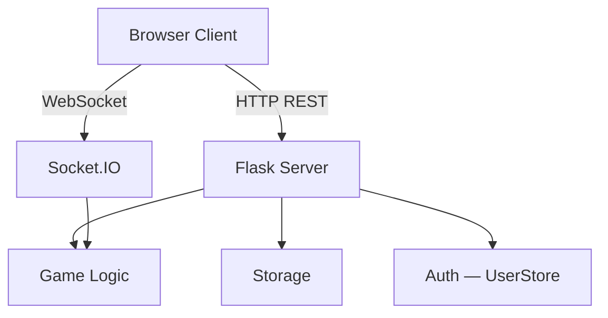
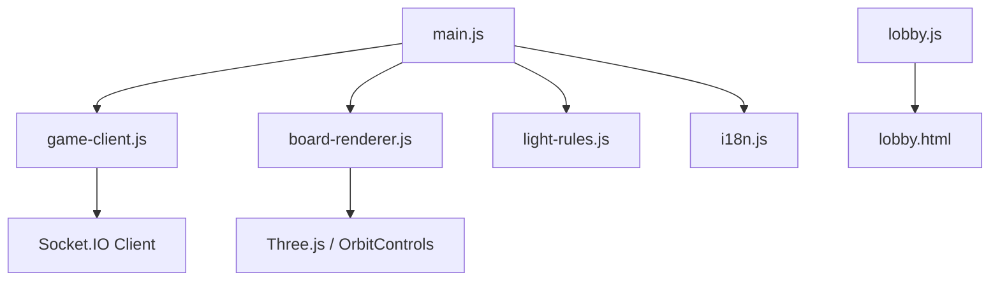
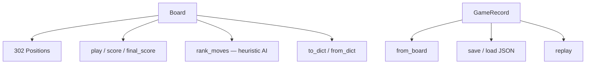
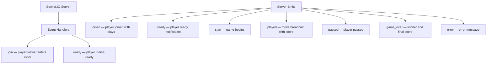
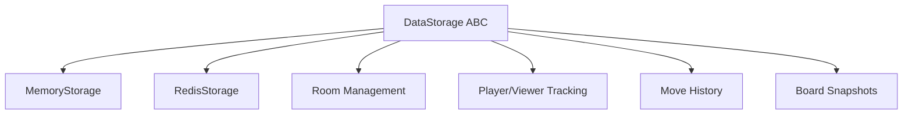
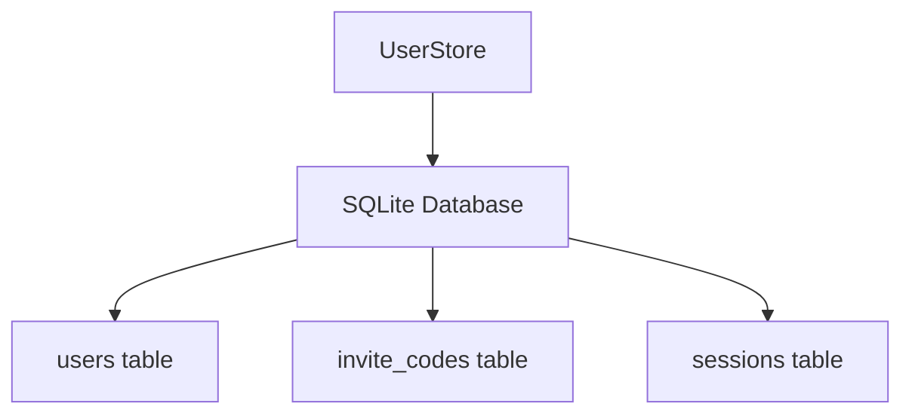

# Architecture

This document provides an overview of the PolyClash architecture, explaining how the different components interact with each other.

## High-Level Architecture

PolyClash follows a client-server architecture. The **server** is a Python Flask + Socket.IO application that hosts game logic, state management, and authentication. The **client** is a browser-based web app built with vanilla JavaScript and Three.js for 3D rendering.


```mermaid
graph TD
    A[Browser Client] -->|HTTP REST| B[Flask Server]
    A -->|WebSocket| C[Socket.IO]

    B --> D[Game Logic]
    B --> E[Storage]
    B --> F[Auth — UserStore]

    C --> D
```

### Client (Web)

The client runs entirely in the browser, served as static files by the Flask server:

- **Three.js 3D Renderer**: Renders the 302-position spherical Go board
- **Game Client**: Manages network communication and local game state
- **Light Rules**: Client-side move validation for immediate feedback
- **Lobby UI**: Login, registration, and room management for team mode
- **i18n**: Internationalization supporting 5 languages

### Server (Python)

The server is a Flask + Socket.IO application that handles:

- **REST API**: HTTP endpoints for game management, moves, and auth
- **Socket.IO**: Real-time events for gameplay synchronization
- **Storage**: Game room and move persistence (memory or Redis)
- **Auth**: User accounts, invite codes, and sessions (SQLite) for team mode

## Component Details

### Web Client Components


```mermaid
graph TD
    A[main.js] --> B[game-client.js]
    A --> C[board-renderer.js]
    A --> D[light-rules.js]
    A --> E[i18n.js]

    F[lobby.js] --> G[lobby.html]
    B --> H[Socket.IO Client]
    C --> I[Three.js / OrbitControls]
```

- **main.js**: Application entry point; initializes the game client and renderer
- **game-client.js (GameClient)**: Network client and state manager; communicates with server via REST and Socket.IO
- **board-renderer.js**: Three.js 3D renderer for the spherical board with orbit controls
- **light-rules.js**: Client-side rule validation for quick move feedback
- **i18n.js**: Internationalization (English, Chinese, Japanese, Korean, French)
- **lobby.js**: Lobby client logic for team mode (login/register/room list)

### Server Components

#### Game Logic


```mermaid
graph TD
    A[Board] --> B[302 Positions]
    A --> C[play / score / final_score]
    A --> D[rank_moves — heuristic AI]
    A --> E[to_dict / from_dict]

    F[GameRecord] --> G[from_board]
    F --> H[save / load JSON]
    F --> I[replay]
```

- **Board** (`polyclash/game/board.py`): Represents the 302-position spherical Go board. Implements stone placement, capture logic, scoring, ko/superko detection via Zobrist hashing, and a heuristic move ranker for AI
- **GameRecord** (`polyclash/game/record.py`): Records game moves; supports save/load (JSON) and replay to reconstruct board state

#### REST API

```mermaid
graph TD
    A[Flask App] --> B[Game Endpoints]
    A --> C[Auth Endpoints]
    A --> D[Lobby Endpoints]
    A --> E[Static Files]

    B --> B1[/sphgo/new]
    B --> B2[/sphgo/join]
    B --> B3[/sphgo/ready]
    B --> B4[/sphgo/play]
    B --> B5[/sphgo/genmove]
    B --> B6[/sphgo/state]
    B --> B7[/sphgo/resign]
    B --> B8[/sphgo/record]
    B --> B9[/sphgo/close]

    C --> C1[/sphgo/auth/register]
    C --> C2[/sphgo/auth/login]
    C --> C3[/sphgo/auth/logout]
    C --> C4[/sphgo/auth/me]
    C --> C5[/sphgo/auth/invite]
    C --> C6[/sphgo/auth/invites]
    C --> C7[/sphgo/auth/users]

    D --> D1[/sphgo/lobby]
    D --> D2[/sphgo/lobby/create]
    D --> D3[/sphgo/lobby/join]
```

- **Game endpoints**: Create, join, ready, play, generate AI move, query state, resign, fetch record, and close games
- **Auth endpoints** (team mode only): Register (with invite code), login, logout, session info, invite code management, user listing
- **Lobby endpoints** (team mode only): List active rooms, create a game, join a game by role
- **Utility endpoints**: `/sphgo/whoami`, `/sphgo/list`, `/sphgo/joined_status`, `/sphgo/ready_status`
- **Static files**: `/` serves `index.html` (game) or `lobby.html` (team mode lobby)

#### Authentication (`api_call` Decorator)

The `api_call` decorator wraps game endpoints and supports three authentication modes:

1. **`server_token`**: Server-level token for administrative or solo-mode access
2. **`player_token`**: Per-player token issued on join; resolves game context (game_id, role)
3. **`skip_auth`**: In solo mode or `--no-auth` mode, player context is resolved without token validation

#### Socket.IO Events


```mermaid
graph TD
    A[Socket.IO Server] --> B[Event Handlers]
    B --> B1[join — player/viewer enters room]
    B --> B2[ready — player marks ready]

    C[Server Emits] --> C1[joined — player joined with plays]
    C --> C2[ready — player ready notification]
    C --> C3[start — game begins]
    C --> C4[played — move broadcast with score]
    C --> C5[passed — player passed]
    C --> C6[game_over — winner and final score]
    C --> C7[error — error message]
```

- **Client → Server**: `join` (enter game room), `ready` (mark ready to play)
- **Server → Client**: `joined`, `ready`, `start`, `played`, `passed`, `game_over`, `error`

#### Storage


```mermaid
graph TD
    A[DataStorage ABC] --> B[MemoryStorage]
    A --> C[RedisStorage]

    A --> D[Room Management]
    A --> E[Player/Viewer Tracking]
    A --> F[Move History]
    A --> G[Board Snapshots]
```

- **DataStorage**: Abstract base class defining the storage interface
- **MemoryStorage**: In-memory dict-based storage for development and solo/family modes
- **RedisStorage**: Redis-backed storage for production deployments (with TTL-based expiry)
- **Board persistence**: `save_board()` / `load_board()` store board snapshots; the server calls `_persist_board()` after each move and `restore_boards()` on startup for crash recovery

#### Auth (Team Mode)


```mermaid
graph TD
    A[UserStore] --> B[SQLite Database]
    B --> C[users table]
    B --> D[invite_codes table]
    B --> E[sessions table]
```

- **UserStore** (`polyclash/util/auth.py`): SQLite-backed user store for team mode
  - Invite-code registration (codes created by admin, single-use)
  - Password login with hashed credentials (werkzeug)
  - Session token management (create, validate, invalidate)
  - Admin user bootstrapping via `ensure_admin()`

## CLI Modes

The unified CLI (`polyclash/cli.py`) provides four modes:

| Command | Description | Auth | Browser |
|---------|-------------|------|---------|
| `polyclash solo` | Human vs AI (single player) | Auto server token | Auto-opens |
| `polyclash family` | LAN game with invite URLs | Server token | Auto-opens |
| `polyclash team` | Self-hosted team server with user accounts | UserStore + invite codes | Manual |
| `polyclash serve` | Deployment server | Configurable (`--no-auth` / `--token`) | Manual |

## Data Flow

### Solo Game Flow

1. User runs `polyclash solo --side black`
2. CLI starts the Flask server in solo mode and opens the browser
3. Browser loads `index.html`, auto-creates a game via `/sphgo/new`
4. Human plays a move → POST `/sphgo/play` → server validates and broadcasts via Socket.IO
5. Browser requests AI move → POST `/sphgo/genmove` → server generates move (HRM engine or heuristic fallback) and broadcasts
6. Game continues until both players pass or a player resigns

### Family Game Flow

1. User runs `polyclash family`
2. CLI creates a game room and prints invite URLs for black, white, and viewer
3. Players open their URLs on LAN devices
4. Each player joins via Socket.IO `join` event, then signals `ready`
5. When both players are ready, server emits `start`
6. Players take turns; moves are validated server-side and broadcast to all clients

### Team Game Flow

1. Admin runs `polyclash team` — server starts with UserStore and invite codes
2. Players open the server URL → see lobby page (`lobby.html`)
3. Players register with invite codes or log in
4. From the lobby, players create or join game rooms
5. Gameplay proceeds as in family mode, with user accounts tracking sessions

## File Structure

```
polyclash/
  __init__.py
  cli.py              # Unified CLI: solo, family, team, serve
  server.py            # Flask + Socket.IO server
  py.typed
  data/
    data.py            # Board geometry data (encoder, decoder, neighbors, areas)
  game/
    board.py           # Board class (302 positions, play, score, to_dict/from_dict)
    record.py          # GameRecord (save/load/replay)
  util/
    api.py             # Python client API (requests-based, for legacy/testing)
    auth.py            # UserStore (SQLite: users, invite_codes, sessions)
    logging.py         # loguru logging setup
    storage.py         # DataStorage ABC, MemoryStorage, RedisStorage
web/
  index.html           # Game page
  lobby.html           # Team mode lobby (login/register/room list)
  css/
    style.css          # Game styles
    lobby.css          # Lobby styles
  js/
    main.js            # App entry point
    game-client.js     # GameClient (network client + state manager)
    board-renderer.js  # Three.js 3D renderer
    light-rules.js     # Client-side rule validation
    i18n.js            # Internationalization (5 languages)
    lobby.js           # Lobby client logic
  vendor/              # three.min.js, socket.io.min.js, OrbitControls.js
  data/                # Board geometry JSON
model3d/               # 3D model generation data
scripts/               # Utility scripts
tests/                 # Unit and integration tests
```

## Design Patterns

- **Client-Server**: All game logic runs on the server; the browser client is a thin rendering and input layer
- **Abstract Storage**: `DataStorage` ABC allows swapping between in-memory and Redis backends
- **Decorator-based Auth**: The `api_call` decorator centralizes authentication and context resolution for all game endpoints
- **Crash Recovery**: Board snapshots are persisted after each move; `restore_boards()` rebuilds in-memory state on server restart
- **Pluggable AI**: The server tries to load the HRM AI engine at startup; falls back to a built-in heuristic move ranker

## Extensibility

- Different storage backends can be added by extending the `DataStorage` ABC
- The AI can be improved by providing an `HRMPlayer` plugin or modifying `Board.rank_moves()`
- New CLI modes can be added as subcommands in `cli.py`
- The web client can be extended with additional UI components or alternative renderers
