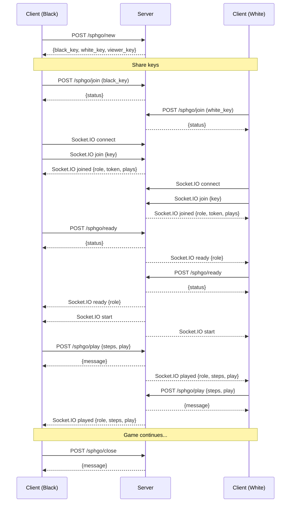

# Network Play

This document provides details about the network play functionality in PolyClash, including how to set up and play games over a network.

## Overview

PolyClash supports network play, allowing players to play against each other over a local network or the internet. The network play functionality is implemented using a client-server architecture with HTTP and WebSocket communication.

## Prerequisites

To play PolyClash over a network, you need:

1. A PolyClash server running on a computer that is accessible to all players
2. PolyClash clients installed on each player's computer
3. Network connectivity between the server and clients

## Server Setup

### Local Network

For playing on a local network, you can run the server on one of the player's computers:

```bash
polyclash-server
```

This will start the server on port 3302. Make note of the server's IP address, which you'll need to connect the clients.

### Internet

For playing over the internet, you need to:

1. Set up a server with a public IP address or domain name
2. Configure your firewall to allow connections to port 3302 (or the port you've configured)
3. Run the server with uWSGI or a similar tool (see [Deployment Guide](09_deployment.md))

## Client Setup

### Connecting to a Server

1. Start the PolyClash client:
   ```bash
   polyclash-client
   ```

2. Select "Network Mode" > "New" from the menu to create a new game, or "Network Mode" > "Join" to join an existing game

3. Enter the server address:
   - For a local server: `http://192.168.1.x:3302` (replace with your server's IP)
   - For an internet server: `http://your-domain.com` or `http://your-public-ip:3302`

### Creating a Game

To create a new game:

1. Select "Network Mode" > "New" from the menu
2. Enter the server address and token (if required)
3. Click "Connect"
4. The server will generate keys for Black, White, and Viewer roles
5. Share the appropriate keys with the other players

### Joining a Game

To join an existing game:

1. Select "Network Mode" > "Join" from the menu
2. Enter the server address
3. Select your role (Black, White, or Viewer)
4. Enter the key you received from the game creator
5. Click "Join"
6. Once joined, click "Ready" to indicate you're ready to start

### Spectating a Game

To spectate a game:

1. Select "Network Mode" > "Join" from the menu
2. Enter the server address
3. Select the "Viewer" role
4. Enter the viewer key you received from the game creator
5. Click "Join"

## Game Flow

1. The game creator creates a new game and receives keys for Black, White, and Viewer roles
2. The game creator shares the keys with the other players
3. Players join the game using their respective keys
4. Players click "Ready" to indicate they're ready to start
5. When all players are ready, the game starts automatically
6. Players take turns making moves
7. The game ends when both players pass consecutively, one player resigns, or no legal moves remain

## Communication Protocol

### REST API

The client communicates with the server using HTTP requests to the following endpoints:

- `/sphgo/new`: Create a new game
- `/sphgo/join`: Join an existing game
- `/sphgo/ready`: Mark a player as ready
- `/sphgo/play`: Make a move
- `/sphgo/close`: End a game

### Socket.IO

The client also connects to the server using Socket.IO for real-time updates:

- `join` event: Player joining a game
- `ready` event: Player ready to start
- `start` event: Game has started
- `played` event: Player made a move
- `error` event: An error occurred

## Authentication

The network play functionality uses token-based authentication:

1. The server generates a server token when it starts
2. When a game is created, the server generates keys for Black, White, and Viewer roles
3. When a player joins a game, the server generates a player token
4. All subsequent requests include the player token for authentication

## Security Considerations

When playing over the internet, consider the following security measures:

1. Use HTTPS for secure communication
2. Set up a reverse proxy (like Nginx) in front of the server
3. Configure your firewall to only allow necessary connections
4. Keep your server and client software up to date

## Troubleshooting

### Connection Issues

If you're having trouble connecting to the server:

1. Check that the server is running
2. Verify that the server address is correct
3. Ensure that your firewall allows connections to the server port
4. Check that the server is accessible from your network

### Game Issues

If you're having trouble with the game:

1. Check that all players have joined the game
2. Ensure that all players have clicked "Ready"
3. Verify that it's your turn before trying to make a move
4. Check the status bar for error messages

## Implementation Details

### Client-Side

The client-side network play functionality is implemented in:

- `polyclash/util/api.py`: Functions for communicating with the server's REST API
- `polyclash/workers/network.py`: Background thread for Socket.IO communication
- `polyclash/game/controller.py`: Game controller with network mode support
- `polyclash/gui/dialogs.py`: Dialogs for network game setup

### Server-Side

The server-side network play functionality is implemented in:

- `polyclash/server.py`: Flask application with REST API endpoints and Socket.IO event handlers
- `polyclash/util/storage.py`: Data storage for game state

## Network Diagram



## Performance Considerations

When playing over a network, consider the following performance factors:

1. **Latency**: High latency can make the game feel sluggish
2. **Bandwidth**: The game requires minimal bandwidth, but ensure you have a stable connection
3. **Server Load**: If multiple games are running on the same server, it may affect performance

## Advanced Configuration

For advanced network play configuration, see the [Deployment Guide](09_deployment.md).
