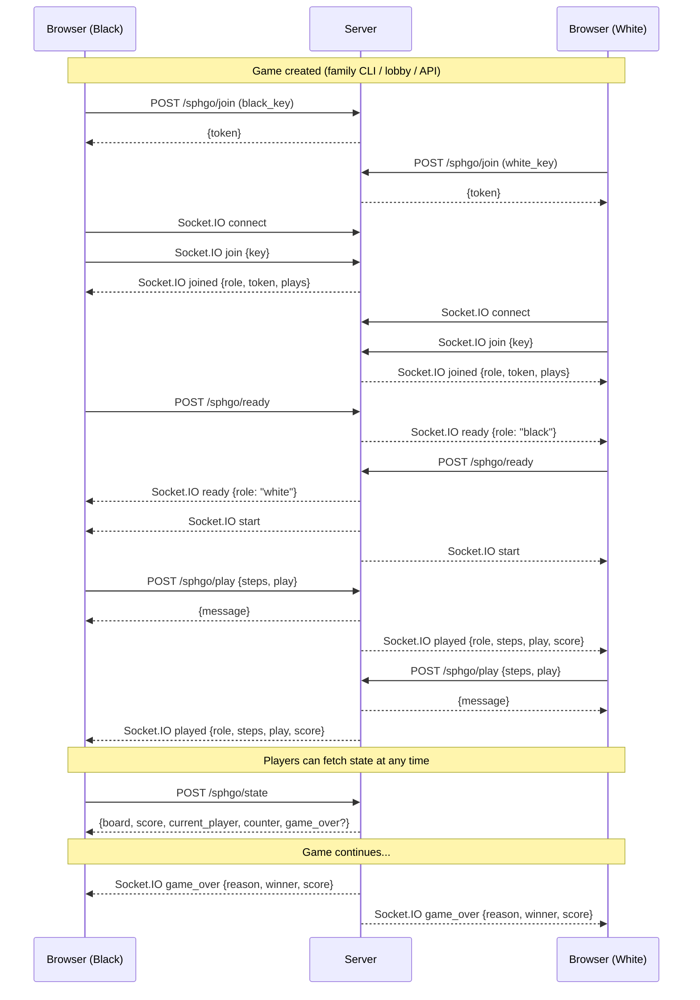

# Network Play

This document provides details about the network play functionality in PolyClash, including how to set up and play games over a network.

## Overview

PolyClash supports network play, allowing players to play against each other over a local network or the internet. The network play functionality is implemented using a client-server architecture with HTTP and WebSocket communication. Players connect via a **web browser** — no desktop client is needed.

PolyClash offers three network play modes:

| Mode | Command | Use Case |
|------|---------|----------|
| **Family** | `polyclash family` | Quick LAN game — server prints URLs, players open them in a browser |
| **Team** | `polyclash team` | Community server — users register with invite codes, create/join games from a web lobby |
| **Serve** | `polyclash serve` | Deployment mode — general-purpose server with token-based game creation |

## Prerequisites

To play PolyClash over a network, you need:

1. A PolyClash server running on a computer that is accessible to all players
2. A modern web browser on each player's device
3. Network connectivity between the server and players

## Mode 1: Family Mode (LAN)

Family mode is the simplest way to play. The server pre-creates a game room and prints invite URLs for each player.

```bash
polyclash family --black human --white human
```

The server will print URLs like:

```
PolyClash 星逐 — Family Game
  Black (Human): http://192.168.1.42:3302/?key=abc123
  White (Human): http://192.168.1.42:3302/?key=def456
  Watch: http://192.168.1.42:3302/?key=ghi789
```

Players open their URL in a browser. They are automatically joined and readied — the game starts as soon as both players connect.

### AI Players

You can set either side to be played by AI:

```bash
polyclash family --black human --white ai
```

When a side is set to `ai`, its URL includes `&ai=1`. The browser client automatically plays moves via the server's `/sphgo/genmove` endpoint.

## Mode 2: Team Mode (Lobby-Based)

Team mode provides a self-hosted game server with user accounts, invite-code registration, and a web lobby.

### Starting the Server

```bash
polyclash team --rooms 8 --admin-pass YOUR_PASSWORD
```

The server will:
1. Create an admin account (`admin` / your password)
2. Generate 5 invite codes (printed to console)
3. Start the web lobby at `http://<your-ip>:3302/`

### Player Flow

1. The admin shares invite codes with players
2. Players visit the server URL and register with their invite code
3. Players log in to the web lobby
4. From the lobby, players can **create** a new game or **join** an existing one (as Black, White, or Viewer)
5. Joining redirects the player to the game page with their key (`/?key=...`)
6. Players are automatically readied upon joining
7. When both players are ready, the game starts

### Authentication

Team mode uses user accounts stored in a SQLite database:

- **Registration** requires an invite code (`POST /sphgo/auth/register`)
- **Login** returns a session token (`POST /sphgo/auth/login`)
- **Admin** users can generate new invite codes and view all users
- Lobby API endpoints (`/sphgo/lobby/*`) require a valid session token

## Mode 3: Serve Mode (Deployment)

Serve mode starts a general-purpose server for LAN or internet deployment.

```bash
polyclash serve --token your-secret-token
```

Players create games using the server token via the `/sphgo/new` API, then share keys with opponents.

For no-auth LAN play:

```bash
polyclash serve --no-auth --host 0.0.0.0 --port 3302
```

## Game Flow

1. A game room is created (automatically in family mode, via lobby in team mode, or via API in serve mode)
2. Each room has three keys: `black_key`, `white_key`, and `viewer_key`
3. Players open their URL or join from the lobby — each receives a player token
4. Players are marked as ready (automatically in family/team mode)
5. When both players are ready, the game starts
6. Players take turns making moves by clicking on the board
7. The game ends when both players pass consecutively, one player resigns, or no legal moves remain
8. A `game_over` event is broadcast with the winner and final score

## Communication Protocol

### REST API

The client communicates with the server using HTTP POST requests to the following endpoints:

| Endpoint | Purpose |
|----------|---------|
| `/sphgo/new` | Create a new game (requires server token) |
| `/sphgo/join` | Join a game with a key and role |
| `/sphgo/whoami` | Discover the role for a given key |
| `/sphgo/ready` | Mark a player as ready |
| `/sphgo/play` | Make a move (sends `steps` and encoded `play`) |
| `/sphgo/state` | Fetch full board state, score, and game-over status |
| `/sphgo/genmove` | Request an AI-generated move |
| `/sphgo/resign` | Resign the game |
| `/sphgo/record` | Download the game record |
| `/sphgo/close` | Close/end a game |

Team mode adds lobby and auth endpoints:

| Endpoint | Purpose |
|----------|---------|
| `/sphgo/auth/login` | Log in with username/password |
| `/sphgo/auth/register` | Register with username/password/invite code |
| `/sphgo/auth/logout` | Log out |
| `/sphgo/auth/me` | Get current user info (including admin status) |
| `/sphgo/auth/invite` | Generate a new invite code (admin only) |
| `/sphgo/auth/invites` | List all invite codes (admin only) |
| `/sphgo/lobby` | List active game rooms |
| `/sphgo/lobby/create` | Create a new game room from the lobby |
| `/sphgo/lobby/join` | Join a game room from the lobby |

### Socket.IO

The client connects via Socket.IO for real-time updates:

| Event | Direction | Data | Description |
|-------|-----------|------|-------------|
| `join` | Client → Server | `{key}` | Join a game room |
| `joined` | Server → Client | `{role, token, plays}` | Confirmation of join |
| `ready` | Server → Client | `{role}` | A player is ready |
| `start` | Server → Client | — | Game has started |
| `played` | Server → Client | `{role, steps, play, score}` | A move was made |
| `passed` | Server → Client | `{role}` | A player passed |
| `game_over` | Server → Client | `{reason, winner, score}` | Game ended |
| `error` | Server → Client | `{message}` | An error occurred |

## Security Considerations

When playing over the internet, consider the following security measures:

1. Use HTTPS for secure communication
2. Set up a reverse proxy (like Nginx) in front of the server
3. Configure your firewall to only allow necessary connections
4. Keep your server and client software up to date

## Troubleshooting

### Connection Issues

If you're having trouble connecting to the server:

1. Check that the server is running
2. Verify that the server address is correct
3. Ensure that your firewall allows connections to the server port
4. Check that the server is accessible from your network

### Game Issues

If you're having trouble with the game:

1. Check that all players have joined the game
2. Verify that both players are ready (check the status bar)
3. Verify that it's your turn before trying to make a move
4. Check the status bar for error messages

## Implementation Details

### Client-Side

The client is a web application served by the PolyClash server:

- `web/js/game-client.js`: Game state manager and server communication (REST + Socket.IO)
- `web/js/lobby.js`: Lobby UI — login, registration, game room management (team mode)
- `web/js/board-renderer.js`: 3D board rendering
- `web/js/light-rules.js`: Client-side move legality checks

### Server-Side

The server-side network play functionality is implemented in:

- `polyclash/server.py`: Flask application with REST API endpoints and Socket.IO event handlers
- `polyclash/util/storage.py`: Data storage for game state (MemoryStorage or RedisStorage)
- `polyclash/util/auth.py`: User accounts and invite codes (team mode)
- `polyclash/cli.py`: CLI entry points for solo, family, team, and serve modes

## Network Diagram


```mermaid
sequenceDiagram
    participant Black as Browser (Black)
    participant Server
    participant White as Browser (White)

    Note over Black, White: Game created (family CLI / lobby / API)

    Black->>Server: POST /sphgo/join (black_key)
    Server-->>Black: {token}
    White->>Server: POST /sphgo/join (white_key)
    Server-->>White: {token}

    Black->>Server: Socket.IO connect
    Black->>Server: Socket.IO join {key}
    Server-->>Black: Socket.IO joined {role, token, plays}

    White->>Server: Socket.IO connect
    White->>Server: Socket.IO join {key}
    Server-->>White: Socket.IO joined {role, token, plays}

    Black->>Server: POST /sphgo/ready
    Server-->>White: Socket.IO ready {role: "black"}

    White->>Server: POST /sphgo/ready
    Server-->>Black: Socket.IO ready {role: "white"}

    Server-->>Black: Socket.IO start
    Server-->>White: Socket.IO start

    Black->>Server: POST /sphgo/play {steps, play}
    Server-->>Black: {message}
    Server-->>White: Socket.IO played {role, steps, play, score}

    White->>Server: POST /sphgo/play {steps, play}
    Server-->>White: {message}
    Server-->>Black: Socket.IO played {role, steps, play, score}

    Note over Black, White: Players can fetch state at any time

    Black->>Server: POST /sphgo/state
    Server-->>Black: {board, score, current_player, counter, game_over?}

    Note over Black, White: Game continues...

    Server-->>Black: Socket.IO game_over {reason, winner, score}
    Server-->>White: Socket.IO game_over {reason, winner, score}
```

## Performance Considerations

When playing over a network, consider the following performance factors:

1. **Latency**: High latency can make the game feel sluggish
2. **Bandwidth**: The game requires minimal bandwidth, but ensure you have a stable connection
3. **Server Load**: If multiple games are running on the same server, it may affect performance

## Advanced Configuration

For advanced network play configuration, see the [Deployment Guide](09_deployment.md).
