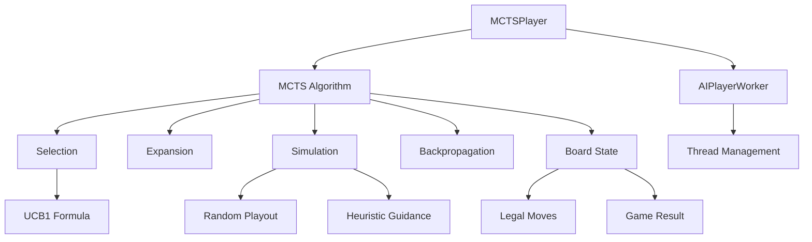

# Phase 3.1: MCTS Implementation for PolyClash AI

This document outlines the detailed plan for implementing Monte Carlo Tree Search (MCTS) algorithm for the PolyClash AI as part of Phase 3.1 of the improvement roadmap. This implementation will significantly enhance the AI's playing strength and strategic depth.

## Goals

- Implement a full-featured Monte Carlo Tree Search (MCTS) algorithm
- Integrate MCTS with the existing game architecture
- Optimize performance for real-time gameplay
- Provide a foundation for future AI enhancements
- Improve AI playing strength compared to the current implementation
- Ensure code quality, maintainability, and testability

## Current Status

The current AI implementation in PolyClash uses a simple algorithm with several limitations:

1. **Limited Look-Ahead**: The AI only samples a few opponent moves (trail = 2) to evaluate positions
2. **Simple Evaluation Function**: Evaluation is based primarily on territory control and captures
3. **No Tree Search**: Moves are evaluated independently without building a search tree
4. **Limited Strategic Understanding**: No pattern recognition or sophisticated positional evaluation
5. **Performance Limitations**: The current approach doesn't scale well with increased computation time

Current implementation details:
- Located in `polyclash/game/board.py` (SimulatedBoard class)
- Uses a simple simulation-based approach
- Evaluates moves based on territory control and captures
- Uses a potential-based tiebreaker for moves with equal scores
- Samples only a few opponent responses

## Implementation Plan

The implementation will be divided into four stages to ensure a systematic and testable approach:

### Stage 1: Core MCTS Framework (2 weeks)

#### 1.1 Create MCTS Node Class

The `MCTSNode` class will represent nodes in the MCTS tree:

```python
class MCTSNode:
    def __init__(self, state, parent=None, move=None):
        self.state = state          # Board state
        self.parent = parent        # Parent node
        self.move = move            # Move that led to this state
        self.children = []          # Child nodes
        self.visits = 0             # Number of visits
        self.wins = 0               # Number of wins
        self.untried_moves = state.get_legal_moves()  # Moves not yet expanded

    def select_child(self):
        # UCB1 formula for balancing exploration and exploitation
        C = 1.41  # Exploration parameter
        return max(self.children, key=lambda c: c.wins/c.visits +
                  C * math.sqrt(math.log(self.visits)/c.visits))

    def expand(self):
        # Create a child node by trying an untried move
        move = self.untried_moves.pop()
        next_state = self.state.copy()
        next_state.play(move, self.state.current_player)
        child = MCTSNode(next_state, self, move)
        self.children.append(child)
        return child

    def update(self, result):
        # Update node statistics
        self.visits += 1
        self.wins += result

    def is_fully_expanded(self):
        return len(self.untried_moves) == 0

    def is_terminal(self):
        return self.state.is_game_over()
```

#### 1.2 Create MCTS Algorithm Class

The `MCTS` class will implement the core MCTS algorithm:

```python
class MCTS:
    def __init__(self, simulation_count=1000, time_limit=5.0):
        self.simulation_count = simulation_count
        self.time_limit = time_limit

    def search(self, state):
        root = MCTSNode(state)
        end_time = time.time() + self.time_limit

        for _ in range(self.simulation_count):
            if time.time() > end_time:
                break

            # Selection phase
            node = self.select(root)

            # Expansion phase
            if not node.is_terminal():
                node = node.expand()

            # Simulation phase
            result = self.simulate(node.state)

            # Backpropagation phase
            self.backpropagate(node, result)

        # Return the best move
        return self.best_move(root)

    def select(self, node):
        while not node.is_terminal() and node.is_fully_expanded():
            node = node.select_child()
        return node

    def simulate(self, state):
        # Random playout until game end
        state_copy = state.copy()
        current_player = state_copy.current_player

        while not state_copy.is_game_over():
            legal_moves = state_copy.get_empties(state_copy.current_player)
            if not legal_moves:
                break
            move = random.choice(legal_moves)
            try:
                state_copy.play(move, state_copy.current_player)
            except ValueError:
                continue

        # Determine winner
        black_score, white_score, _ = state_copy.score()
        if black_score > white_score:
            return 1 if current_player == BLACK else 0
        else:
            return 1 if current_player == WHITE else 0

    def backpropagate(self, node, result):
        while node is not None:
            node.update(result)
            node = node.parent
            # Flip result for opponent's perspective
            result = 1 - result

    def best_move(self, root):
        # Return move with highest visit count
        return max(root.children, key=lambda c: c.visits).move
```

#### 1.3 Create MCTSPlayer Class

The `MCTSPlayer` class will integrate MCTS with the existing player framework:

```python
class MCTSPlayer(Player):
    def __init__(self, **kwargs):
        super().__init__(kind=AI, **kwargs)
        self.worker = AIPlayerWorker(self)
        self.simulation_count = kwargs.get('simulation_count', 1000)
        self.time_limit = kwargs.get('time_limit', 5.0)
        self.mcts = MCTS(self.simulation_count, self.time_limit)

    def auto_place(self):
        while self.board.current_player == self.side:
            try:
                self.board.disable_notification()
                # Use MCTS to generate a move
                position = self.mcts.search(self.board)
                self.board.enable_notification()
                self.play(position)
                break
            except ValueError:
                continue
```

#### 1.4 Integration with Existing Board Class

Extend the `Board` class to support MCTS operations:

```python
class Board:
    # Add methods to support MCTS

    def copy(self):
        """Create a deep copy of the board state"""
        board_copy = Board()
        board_copy.board = self.board.copy()
        board_copy.current_player = self.current_player
        board_copy.latest_removes = [list(r) for r in self.latest_removes]
        board_copy.black_suicides = self.black_suicides.copy()
        board_copy.white_suicides = self.white_suicides.copy()
        board_copy.turns = self.turns.copy()
        return board_copy
```

#### 1.5 File Structure Updates

Create new files for MCTS implementation:
- `polyclash/game/mcts.py`: Contains MCTS and MCTSNode classes
- `polyclash/game/mcts_player.py`: Contains MCTSPlayer class

Update existing files:
- `polyclash/game/player.py`: Add import for MCTSPlayer
- `polyclash/game/board.py`: Add support methods for MCTS

### Stage 2: MCTS Enhancements (2 weeks)

#### 2.1 Improve Simulation Policy

Enhance the simulation policy to use domain knowledge:

```python
def simulate(self, state):
    """Improved simulation with heuristic guidance"""
    state_copy = state.copy()
    current_player = state_copy.current_player

    while not state_copy.is_game_over():
        legal_moves = state_copy.get_empties(state_copy.current_player)
        if not legal_moves:
            break

        # Prioritize moves that capture stones
        capture_moves = []
        for move in legal_moves:
            temp_board = state_copy.copy()
            try:
                temp_board.play(move, temp_board.current_player)
                if temp_board.latest_removes and len(temp_board.latest_removes[-1]) > 0:
                    capture_moves.append(move)
            except ValueError:
                continue

        if capture_moves and random.random() < 0.8:  # 80% chance to choose a capture move
            move = random.choice(capture_moves)
        else:
            move = random.choice(legal_moves)

        try:
            state_copy.play(move, state_copy.current_player)
        except ValueError:
            continue

    # Determine winner
    black_score, white_score, _ = state_copy.score()
    if black_score > white_score:
        return 1 if current_player == BLACK else 0
    else:
        return 1 if current_player == WHITE else 0
```

#### 2.2 Add RAVE (Rapid Action Value Estimation)

Implement RAVE to improve move selection:

```python
class MCTSNode:
    def __init__(self, state, parent=None, move=None):
        # Existing attributes
        self.amaf_wins = 0  # All-Moves-As-First wins
        self.amaf_visits = 0  # All-Moves-As-First visits

    def select_child(self):
        # RAVE formula
        C = 1.41  # Exploration parameter
        beta = 0.5  # RAVE weight parameter

        def score(child):
            # UCB score
            ucb = child.wins/child.visits + C * math.sqrt(math.log(self.visits)/child.visits)

            # RAVE score
            if child.amaf_visits > 0:
                rave = child.amaf_wins/child.amaf_visits
            else:
                rave = 0

            # Combine UCB and RAVE
            return (1-beta) * ucb + beta * rave

        return max(self.children, key=score)
```

#### 2.3 Add Progressive Widening

Implement progressive widening to handle large branching factors:

```python
def expand(self):
    # Progressive widening - limit expansion based on visit count
    k = 10  # Widening parameter
    c = 0.5  # Widening exponent
    max_children = int(k * self.visits**c)

    if len(self.children) >= max_children:
        # Don't expand further at this visit count
        return self.select_child()

    # Regular expansion
    move = self.untried_moves.pop()
    next_state = self.state.copy()
    next_state.play(move, self.state.current_player)
    child = MCTSNode(next_state, self, move)
    self.children.append(child)
    return child
```

#### 2.4 Add Virtual Loss

Implement virtual loss to encourage thread divergence in parallel MCTS:

```python
def add_virtual_loss(self):
    """Add a virtual loss to this node"""
    self.visits += 1
    self.wins -= 1  # Subtract a win (add a loss)

def remove_virtual_loss(self):
    """Remove the virtual loss from this node"""
    self.visits -= 1
    self.wins += 1  # Add a win (remove a loss)
```

#### 2.5 Implement Early Stopping

Add early stopping to terminate simulations early when the outcome is clear:

```python
def simulate(self, state):
    """Simulation with early stopping"""
    state_copy = state.copy()
    current_player = state_copy.current_player
    max_moves = 100  # Maximum number of moves to simulate

    for _ in range(max_moves):
        if state_copy.is_game_over():
            break

        # Early stopping condition
        black_score, white_score, _ = state_copy.score()
        score_diff = abs(black_score - white_score)
        if score_diff > 0.3:  # If one player has a significant lead
            # Return result based on current score
            if black_score > white_score:
                return 1 if current_player == BLACK else 0
            else:
                return 1 if current_player == WHITE else 0

        # Regular simulation step
        # ...
```

### Stage 3: Performance Optimization (1 week)

#### 3.1 Parallel MCTS

Implement parallel MCTS using multiple threads:

```python
class ParallelMCTS(MCTS):
    def __init__(self, simulation_count=1000, time_limit=5.0, num_threads=4):
        super().__init__(simulation_count, time_limit)
        self.num_threads = num_threads

    def search(self, state):
        root = MCTSNode(state)
        end_time = time.time() + self.time_limit

        def worker():
            while time.time() < end_time:
                # Run one MCTS iteration
                node = self.select(root)
                if not node.is_terminal():
                    node = node.expand()
                result = self.simulate(node.state)
                self.backpropagate(node, result)

        threads = []
        for _ in range(self.num_threads):
            thread = threading.Thread(target=worker)
            thread.start()
            threads.append(thread)

        for thread in threads:
            thread.join()

        return self.best_move(root)
```

#### 3.2 Memory Optimization

Optimize memory usage in the MCTS tree:

```python
class MCTSNode:
    def __init__(self, state, parent=None, move=None):
        self.state = state  # Board state
        self.parent = parent  # Parent node
        self.move = move  # Move that led to this state
        self.children = []  # Child nodes
        self.visits = 0  # Number of visits
        self.wins = 0  # Number of wins

        # Store only legal moves instead of full state
        if state is not None:
            self.untried_moves = state.get_legal_moves()
            self.player = state.current_player
        else:
            self.untried_moves = []
            self.player = None

        # Don't store state in leaf nodes to save memory
        if parent is not None and parent.parent is not None:
            self.state = None
```

#### 3.3 Algorithm Optimization

Optimize critical parts of the algorithm:

```python
def select(self, node):
    """Optimized selection phase"""
    path = []
    while not node.is_terminal() and node.is_fully_expanded():
        # Add virtual loss to encourage thread divergence
        node.add_virtual_loss()
        path.append(node)

        # Use numpy for faster child selection
        if len(node.children) > 10:
            visits = np.array([c.visits for c in node.children])
            wins = np.array([c.wins for c in node.children])
            log_visits = np.log(node.visits)

            # UCB1 formula
            C = 1.41
            ucb_scores = wins / visits + C * np.sqrt(log_visits / visits)
            best_idx = np.argmax(ucb_scores)
            node = node.children[best_idx]
        else:
            node = node.select_child()

    # Remove virtual losses
    for n in path:
        n.remove_virtual_loss()

    return node
```

#### 3.4 Profiling and Optimization

Profile the MCTS implementation and optimize bottlenecks:

```python
def profile_mcts():
    """Profile MCTS performance"""
    import cProfile
    import pstats

    board = Board()
    mcts = MCTS(simulation_count=1000, time_limit=5.0)

    # Profile the search function
    cProfile.runctx('mcts.search(board)', globals(), locals(), 'mcts_profile.prof')

    # Analyze the results
    stats = pstats.Stats('mcts_profile.prof')
    stats.strip_dirs().sort_stats('cumulative').print_stats(20)
```

### Stage 4: Testing and Evaluation (1 week)

#### 4.1 Unit Tests for MCTS Components

Create unit tests for MCTS components:

```python
def test_mcts_node():
    """Test MCTSNode functionality"""
    board = Board()
    node = MCTSNode(board)

    # Test initialization
    assert node.visits == 0
    assert node.wins == 0
    assert len(node.untried_moves) > 0

    # Test expansion
    child = node.expand()
    assert child in node.children
    assert child.parent == node
    assert child.visits == 0

    # Test update
    child.update(1)
    assert child.visits == 1
    assert child.wins == 1

    # Test selection
    node.visits = 10
    node.wins = 5
    for _ in range(5):
        node.expand()
    for child in node.children:
        child.visits = 2
        child.wins = 1
    selected = node.select_child()
    assert selected in node.children
```

#### 4.2 Integration Tests

Create integration tests for MCTS with the game:

```python
def test_mcts_integration():
    """Test MCTS integration with the game"""
    board = Board()
    mcts = MCTS(simulation_count=100, time_limit=1.0)

    # Test search function
    move = mcts.search(board)
    assert move in board.get_empties(board.current_player)

    # Test playing a move
    board.play(move, board.current_player)
    assert board.board[move] == board.current_player

    # Test MCTSPlayer
    board = Board()
    player = MCTSPlayer(side=BLACK, simulation_count=100, time_limit=1.0)
    player.board = board
    player.auto_place()
    assert board.counter > 0
```

#### 4.3 Benchmarking

Create benchmarks to compare MCTS against the current AI:

```python
def benchmark_mcts():
    """Benchmark MCTS against current AI"""
    wins = 0
    games = 100

    for i in range(games):
        board = Board()
        mcts_player = MCTSPlayer(side=BLACK)
        current_ai = AIPlayer(side=WHITE)

        while not board.is_game_over():
            if board.current_player == BLACK:
                move = mcts_player.mcts.search(board)
                board.play(move, BLACK)
            else:
                move = board.genmove(WHITE)
                board.play(move, WHITE)

        black_score, white_score, _ = board.score()
        if black_score > white_score:
            wins += 1

    win_rate = wins / games
    return win_rate
```

## Testing Strategy

### Unit Tests

- Test each MCTS component individually:
  - MCTSNode class
  - MCTS algorithm (selection, expansion, simulation, backpropagation)
  - MCTSPlayer integration

### Integration Tests

- Test MCTS integration with the game:
  - Move generation
  - Game play
  - Player interaction

### Performance Tests

- Benchmark MCTS performance:
  - Nodes explored per second
  - Memory usage
  - Scaling with time limit and simulation count

### Comparative Tests

- Compare MCTS against the current AI:
  - Win rate
  - Game length
  - Territory control
  - Capture efficiency

## Dependencies

```
numpy>=1.20.0
scipy>=1.7.0
PyQt5>=5.15.0
threading
time
random
math
```

## Success Criteria

1. **Functionality**: MCTS AI successfully plays legal moves and completes games
2. **Performance**: MCTS can perform at least 1000 simulations per second on a standard machine
3. **Strength**: MCTS AI achieves at least 70% win rate against the current AI
4. **Code Quality**: All tests pass, code is well-documented and follows project style guidelines
5. **Integration**: MCTS AI seamlessly integrates with existing UI and game flow
6. **Scalability**: Performance improves with increased computation time
7. **Memory Efficiency**: Memory usage remains reasonable during long games

## Timeline

| Week | Tasks |
|------|-------|
| 1 | Implement core MCTS framework (MCTSNode, MCTS class) |
| 2 | Integrate MCTS with existing game (MCTSPlayer, Board extensions) |
| 3 | Implement MCTS enhancements (improved simulation, RAVE) |
| 4 | Implement additional enhancements (progressive widening, virtual loss) |
| 5 | Optimize performance (parallel MCTS, memory optimization) |
| 6 | Testing and evaluation (unit tests, integration tests, benchmarking) |

## Next Steps

After completing the MCTS implementation, the following steps will be taken:

1. **Documentation**: Update project documentation to reflect the new AI implementation
2. **User Interface**: Add options for selecting AI type and difficulty
3. **Future Enhancements**: Prepare for Phase 3 AI enhancements:
   - Position evaluation heuristics
   - Opening book
   - Endgame solver
   - Difficulty levels
   - AI training and learning

## Architecture Diagram


